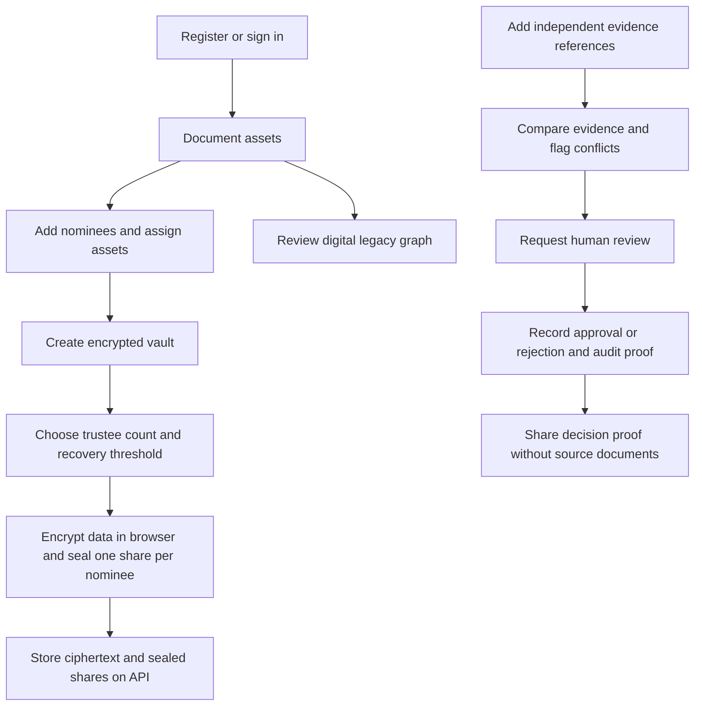

# Vaaris — Digital Legacy Management

Vaaris helps people document what should happen to their digital assets and how trusted nominees can receive access. It includes an encrypted vault, a digital-asset inventory, nominee planning, recovery workflows, and an evidence-led proof-of-death review flow.

## Features

- **Account-specific setup:** Registration creates an empty account. Example nominees and assets are available only in the explicitly selected demo account.
- **Legacy planner and graph:** Track accounts, subscriptions, cloud storage, domains, wallets, important files, actions, and nominee assignments. The graph uses only the inventory you enter; Vaaris does not scan private accounts.
- **Proof-of-death review:** Record independent evidence references, compare corroborating and conflicting findings, request human review, and record an approval or rejection with a hash-linked audit trail. Beneficiary-facing proof contains the decision hash, not source documents.
- **Encrypted vault:** Sensitive fields are encrypted in the browser before upload. The API stores ciphertext and nominee-sealed recovery shares.
- **Adaptive trustee recovery:** Split the vault key across 2–5 nominees with a threshold from 2 up to the share count. Changing an existing vault's policy requires recovering it and rotating the encryption key and all shares together.
- **Nominees and heir portal:** Assign assets, manage access instructions, and provide a nominee-facing portal.
- **Verification triggers and notifications:** Explore the multi-stage handover flow and notification integrations/simulator.

## User flow



## Local development

### Requirements

- Python 3.11 or newer
- Node.js 18 or newer and npm

### Backend

```bash
cd backend
pip install -r requirements.txt
python -m uvicorn app.main:app --reload --port 8000
```

The API creates its configured database on startup. Configure database and optional integration credentials through environment variables; do not commit `.env` files.

### Frontend

In another terminal:

```bash
cd frontend
npm install
npm run dev
```

Open <http://localhost:5173>. The API docs are at <http://localhost:8000/docs>.

## Demo account

Choose **Try the demo account** on the sign-in page to seed and enter the demo profile. Demo records are intentionally separate from accounts created through registration.

## Security and scope notes

- Proof-of-death evidence references, decisions, and hash-chain audit entries currently persist in that browser's local storage, scoped by account. They are not a server-side or tamper-proof legal record; a local hash chain can detect edits but cannot prevent them.
- Evidence sources are entered by the account holder. Vaaris does not currently have an official government death-record verification integration. Use official channels such as the relevant state e-District service for authoritative checks.
- Legacy graph reminders are browser-local. No connected account is scanned unless the user explicitly provides inventory or authorizes a future integration.
- The API never needs third-party account passwords. Do not store them in asset instructions.
- Trustee private-key files must be kept by their respective custodians. Vaaris cannot recover a lost private key.
- Changing a vault recovery threshold is a cryptographic operation: recover the contents, generate a fresh encryption key, encrypt again, and replace the sealed shares in the same rotation. Editing only the threshold metadata is unsafe.
- Configure strong application secrets, HTTPS, database access controls, backups, and deployment-specific rate limits before production use.

## Repository layout

```text
backend/       FastAPI API, SQLAlchemy models, authentication, and services
frontend/      React + Vite application
database/      Database schemas and seed scripts
```

## Optional integrations

Twilio WhatsApp and Supabase can be configured with environment variables. See `.env.example` for the available setting names and never commit real credentials.
